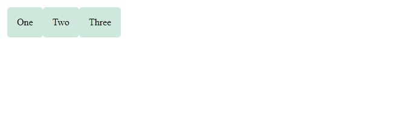
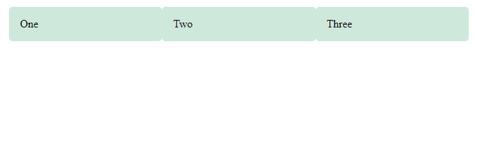
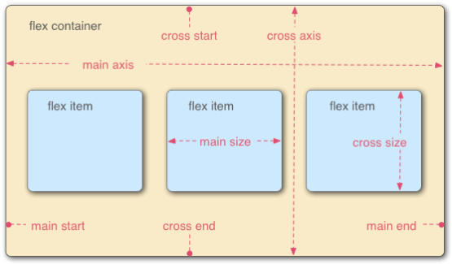

# - Flexbox

<b>`Flexbox`</b> é o nome abreviado para o módulo `CSS Flexible Box Layout` , projetado para facilitar o layout das coisas em uma dimensão - como uma linha ou uma coluna. Para usar o `flexbox`, você aplica `display: flex` ao elemento pai dos elementos que deseja dispor; todos os seus filhos diretos se tornam <b>itens flexíveis</b>. Podemos ver isso em um exemplo simples.

<br>

## Exibição de configuração: flex

A marcação `HTML` abaixo nos fornece um elemento de contenção com uma classe de `wrapper`, dentro da qual estão três elementos `<div>`. Por padrão, eles seriam exibidos como elementos de `block`, ou seja, um abaixo do outro em nosso documento.

No entanto, se adicionarmos `display: flex` ao pai, os três itens agora se organizam em colunas. Isso ocorre porque eles se tornam <b>itens flexíveis</b> e são afetados por alguns valores iniciais que o `flexbox` define no <b>contêiner flex</b>. Eles são exibidos em uma linha porque a propriedade `flex-direction` do elemento pai tem um valor inicial de `row`. Todos eles parecem se estender em altura porque a propriedade `align-items` de seu elemento pai tem um valor inicial de `stretch`. Isso significa que os itens se estendem até a altura do <b>contêiner flexível</b>, que neste caso é definido pelo item mais alto. Todos os itens se alinham no início do contêiner, deixando espaço extra no final da linha.

```css
.wrapper {
  display: flex;
}
```

```html
<div class="wrapper">
  <div class="box1">One</div>
  <div class="box2">Two</div>
  <div class="box3">Three</div>
</div>
```



<br>

## Configurando a propriedade flex

Além das propriedades que podem ser aplicadas a um <b>contêiner flexível</b> , também existem propriedades que podem ser aplicadas a <b>itens flexíveis</b> . Essas propriedades, entre outras coisas, podem alterar a maneira como os itens são flexíveis , permitindo que eles se expandam ou contraiam de acordo com o espaço disponível.

Como um exemplo simples, podemos adicionar a propriedade `flex` a todos os nossos itens filhos e dar a ela um valor de 1. Isso fará com que todos os itens cresçam e preencham o recipiente, em vez de deixar espaço no final. Se houver mais espaço, os itens ficarão mais largos; se houver menos espaço, eles se tornarão mais estreitos. Além disso, se você adicionar outro elemento à marcação, todos os outros itens ficarão menores para liberar espaço; os itens todos juntos continuam ocupando todo o espaço.

```css
.wrapper {
  display: flex;
}

.wrapper > div {
  flex: 1;
}
```

```html
<div class="wrapper">
  <div class="box1">One</div>
  <div class="box2">Two</div>
  <div class="box3">Three</div>
</div>
```



<br>

## Flex Model

Quando os elementos são dispostos como itens flexíveis, eles são dispostos ao longo de dois eixos:



- O <b>main axis</b> é o eixo que corre na direção em que os itens flexíveis são dispostos (por exemplo, como linhas na página ou colunas na página). O início e o fim desse eixo são chamados de <b>main start</b> e <b>main end</b> .

- O <b>cross axis</b> é o eixo perpendicular à direção em que os itens flexíveis são dispostos. O início e o fim desse eixo são chamados de <b>cross start</b> e <b>cross end</b>.

- O elemento pai que foi `display: flex` definido nele é chamado de `flex container` .

- Os itens dispostos como caixas flexíveis dentro do flex container são chamados de `flex items`.
