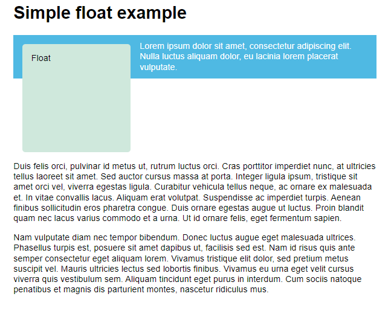
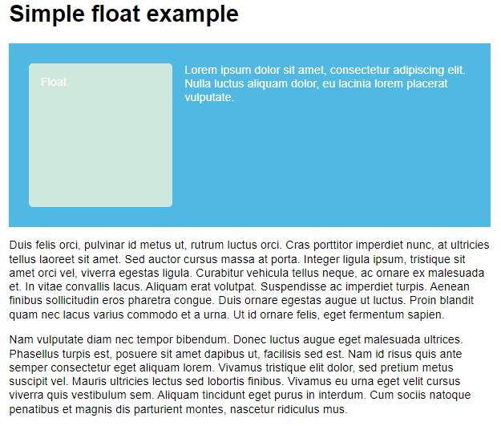

# - Floats

> A flutuação de um elemento altera o comportamento desse elemento e os elementos de nível de bloco que o seguem no fluxo normal. O elemento flutuante é movido para a esquerda ou direita e removido do fluxo normal, e o conteúdo ao redor flutua em torno dele.

A propriedade `float` tem quatro valores possíveis:

- `left` — Flutua o elemento para a esquerda.
- `right` — Flutua o elemento para a direita.
- `none` — Especifica nenhuma flutuação. Este é o valor padrão.
- `inherit` — Especifica que o valor da propriedade `float` deve ser herdado do elemento pai do elemento.

No exemplo abaixo, flutuamos `<div>` à esquerda e <b>margin</b> à direita para afastar o texto circundante. Isso nos dá o efeito de texto enrolado em torno do elemento em caixa e é a maior parte do que você precisa saber sobre flutuadores usados ​​no design moderno da web.

```css
.box {
  float: left;
  width: 150px;
  height: 150px;
  margin-right: 30px;
}
```

```html
<h1>Simple float example</h1>

<div class="box">Float</div>
<p>
  Lorem ipsum dolor sit amet, consectetur adipiscing elit. Nulla luctus aliquam
  dolor, eu lacinia lorem placerat vulputate. Duis felis orci, pulvinar id metus
  ut, rutrum luctus orci. Cras porttitor imperdiet nunc, at ultricies tellus
  laoreet sit amet. Sed auctor cursus massa at porta. Integer ligula ipsum,
  tristique sit amet orci vel, viverra egestas ligula. Curabitur vehicula tellus
  neque, ac ornare ex malesuada et. In vitae convallis lacus. Aliquam erat
  volutpat. Suspendisse ac imperdiet turpis. Aenean finibus sollicitudin eros
  pharetra congue. Duis ornare egestas augue ut luctus. Proin blandit quam nec
  lacus varius commodo et a urna. Ut id ornare felis, eget fermentum sapien.
</p>
```


> Nota: Antes de técnicas como Flexbox e Grid Layout, os floats eram usados ​​como um método de criação de layouts de coluna.

## Limpando floats

Vimos que um float é removido do fluxo normal e que outros elementos serão exibidos ao lado dele. Se quisermos impedir que o seguinte elemento suba, precisamos limpá -lo; isso é conseguido com a propriedade `clear`.

```css
.cleared {
  clear: left;
}
```



Você deve ver que o segundo parágrafo agora limpa o elemento flutuante e não aparece mais ao lado dele. A propriedade `clear` aceita os seguintes valores:

- `left`: Limpar itens flutuando para a esquerda.
- `right`: Limpar itens flutuando para a direita.
- `both`: Limpe todos os itens flutuantes, à esquerda ou à direita.

## Clearfix Hack

A maneira como essa situação tem sido tradicionalmente tratada é usando algo conhecido como `"hack clearfix"`. Isso envolve primeiro inserir algum conteúdo gerado após a caixa que contém o `float` e o conteúdo ao redor dele e, em seguida, definir esse conteúdo gerado para limpar ambos.

Adicione o seguinte CSS:

```css
.wrapper::after {
  content: '';
  clear: both;
  display: block;
}
```

A caixa deve ser limpa. Isso é essencialmente o mesmo que se você tivesse adicionado um elemento HTML como `<div>` abaixo dos itens e definido como `clear: both`.



## Usando overflow

Um método alternativo é definir a propriedade `overflow` do `wrapper` para um valor diferente de `visible`.

Remova o CSS `clearfix` que você adicionou na última seção; em vez disso, adicione `overflow: auto` às regras para `wrapper`. Mais uma vez, a caixa deve limpar.

```css
.wrapper {
  background-color: rgb(79, 185, 227);
  padding: 10px;
  color: #fff;
  overflow: auto;
}
```

> Este exemplo funciona criando o que é conhecido como `contexto de formatação de bloco (BFC)`. Isso é como um mini layout dentro de sua página, dentro do qual tudo está contido. Isso significa que nosso elemento flutuante está contido dentro do `BFC` e o plano de fundo é executado por trás de ambos os itens. Isso geralmente funcionará; no entanto, em certos casos, você pode encontrar barras de rolagem indesejadas ou sombras cortadas devido a consequências não intencionais do uso de estouro.
>
> > A maneira moderna de resolver esse problema é usar o valor `flow-root` do `display` imóvel. Isso existe apenas para criar um `BFC` sem usar `hacks` - não haverá consequências não intencionais ao usá-lo. Remova `overflow: auto` da sua regra `.wrapper` e adicione `display: flow-root`. Supondo que você tenha um navegador compatível , a caixa será desmarcada.

<br>
