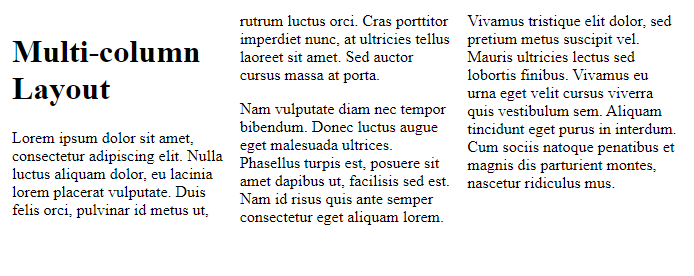

# Multi-column Layout

> O módulo `CSS` de layout de várias colunas nos fornece uma maneira de dispor o conteúdo em colunas, semelhante a como o texto flui em um jornal. Embora a leitura de colunas para cima e para baixo seja menos útil em um contexto da Web devido aos usuários terem que rolar para cima e para baixo, organizar o conteúdo em colunas pode, no entanto, ser uma técnica útil.

Para transformar um bloco em um contêiner de várias colunas, usamos a propriedade `column-count` , que informa ao navegador quantas colunas gostaríamos de ter, ou a propriedade `column-width` , que informa ao navegador para preencher o contêiner com o máximo de colunas possível de um largura especificada .

No exemplo abaixo, começamos com um bloco de `HTML` dentro de um elemento `<div>` contendo uma classe de `container`.

```html
<div class="container">
  <h1>Multi-column Layout</h1>

  <p>
    Lorem ipsum dolor sit amet, consectetur adipiscing elit. Nulla luctus
    aliquam dolor, eu lacinia lorem placerat vulputate. Duis felis orci,
    pulvinar id metus ut, rutrum luctus orci. Cras porttitor imperdiet nunc, at
    ultricies tellus laoreet sit amet. Sed auctor cursus massa at porta.
  </p>

  <p>
    Nam vulputate diam nec tempor bibendum. Donec luctus augue eget malesuada
    ultrices. Phasellus turpis est, posuere sit amet dapibus ut, facilisis sed
    est. Nam id risus quis ante semper consectetur eget aliquam lorem.
  </p>

  <p>
    Vivamus tristique elit dolor, sed pretium metus suscipit vel. Mauris
    ultricies lectus sed lobortis finibus. Vivamus eu urna eget velit cursus
    viverra quis vestibulum sem. Aliquam tincidunt eget purus in interdum. Cum
    sociis natoque penatibus et magnis dis parturient montes, nascetur ridiculus
    mus.
  </p>
</div>
```

Estamos usando um `column-width` de `200 pixels` nesse contêiner, fazendo com que o navegador crie quantas colunas de `200 pixels` couberem. Qualquer espaço deixado entre as colunas será compartilhado.<br>

```css
.container {
  column-width: 200px;
}
```



<br>
