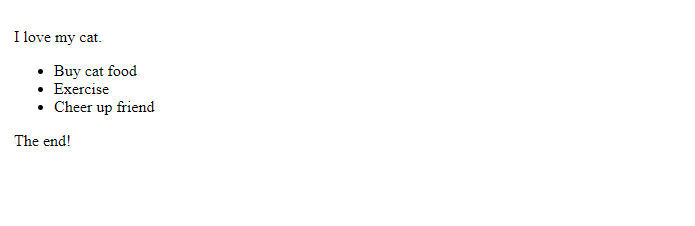

# - Normal Flow

> O fluxo normal é como o navegador apresenta as páginas HTML por padrão quando você não faz nada para controlar o layout da página. <br>Vejamos um exemplo rápido de HTML:

```html
<p>I love my cat.</p>

<ul>
  <li>Buy cat food</li>
  <li>Exercise</li>
  <li>Cheer up friend</li>
</ul>

<p>The end!</p>
```

<h3>Por padrão, o navegador exibirá este código da seguinte forma:</h3>



Os elementos que aparecem um abaixo do outro são descritos como elementos de `block` , em contraste com os elementos `inline` , que aparecem um ao lado do outro como as palavras individuais em um parágrafo.

Para muitos dos elementos da sua página, o fluxo normal criará exatamente o layout que você precisa. No entanto, para layouts mais complexos, você precisará alterar esse comportamento padrão usando algumas das ferramentas disponíveis em `CSS`. Começar com um documento `HTML` bem estruturado é muito importante porque você pode trabalhar com a forma como as coisas são dispostas por padrão, em vez de lutar contra isso.

<h3>Os métodos que podem alterar a forma como os elementos são dispostos no CSS são:</h3>

- <b>Propriedade `display` — </b>Valores padrão como `block, inline ou inline-block` podem alterar como os elementos se comportam no fluxo normal, por exemplo, fazendo com que um elemento de nível `block` se comporte como um elemento de nível `inline` (consulte Tipos de caixas CSS para obter mais informações). Também temos métodos de layout completos que são habilitados por meio de displayvalores específicos, por exemplo, CSS Grid e Flexbox , que alteram como os elementos filhos são dispostos dentro de seus pais.

- <b>`Floats` — </b> A aplicação de um `float` valor como `left` pode fazer com que os elementos de nível de bloco se envolvam ao longo de um lado de um elemento, como a forma como as imagens às vezes têm texto flutuando ao redor delas em layouts de revista.

- <b>Propriedade `position` — </b> Permite controlar com precisão a colocação de caixas dentro de outras caixas. O posicionamento `static` é o padrão no fluxo normal, mas você pode fazer com que os elementos sejam dispostos de forma diferente usando outros valores, por exemplo, como fixado na parte superior da janela de visualização do navegador.

- <b>`Table layout` — </b> Os recursos projetados para estilizar partes de uma tabela HTML podem ser usados ​​em elementos que não são de tabela usando `display: table` e propriedades associadas.

- <b>`Multi-column layout` — </b> As propriedades de layout de várias colunas podem fazer com que o conteúdo de um `block` seja exibido em colunas, como você pode ver em um jornal.

<br>
