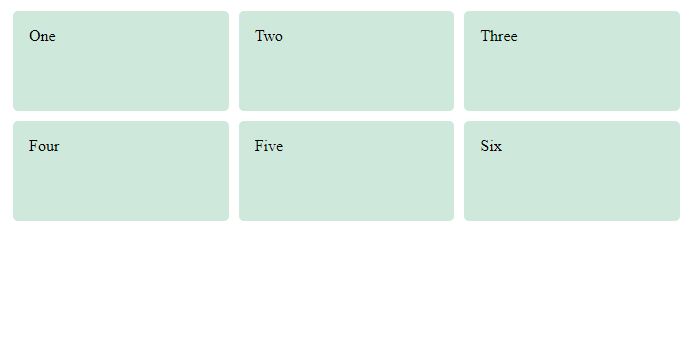
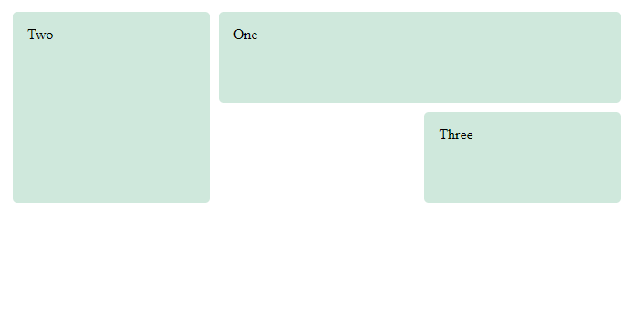
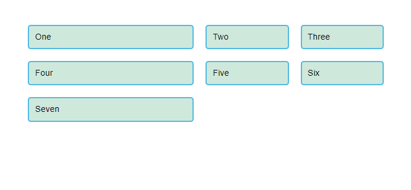
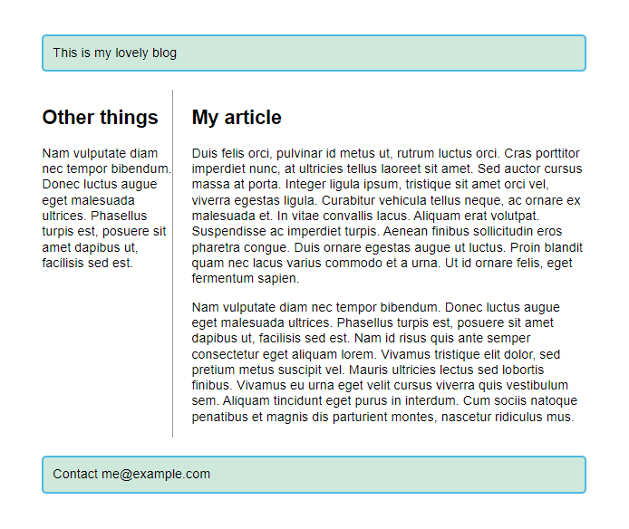

# - Grid Layout

> Enquanto o flexbox é projetado para um layout unidimensional, o Grid Layout é projetado para duas dimensões – alinhando as coisas em linhas e colunas.

<br>

## Configuração Display: grid

Semelhante ao flexbox, habilitamos Grid Layout com seu valor de exibição específico — `display: grid`. O exemplo abaixo usa marcação semelhante ao exemplo flex, com um contêiner e alguns elementos filho. Além de usar `display: grid`, também definimos algumas faixas de linha e coluna para o pai usando as propriedades `grid-template-rows` e `grid-template-columns` respectivamente. Definimos três colunas, cada uma de `1fr`, bem como duas linhas de `100px`. Não precisamos colocar nenhuma regra nos elementos filhos; eles são colocados automaticamente nas células criadas por nossa grade.

```css
.wrapper {
  display: grid;
  grid-template-columns: 1fr 1fr 1fr;
  grid-template-rows: 100px 100px;
  gap: 10px;
}
```

```html
<div class="wrapper">
  <div class="box1">One</div>
  <div class="box2">Two</div>
  <div class="box3">Three</div>
  <div class="box4">Four</div>
  <div class="box5">Five</div>
  <div class="box6">Six</div>
</div>
```



<br>

## Colocando itens na grid

Depois de ter uma `grid`, você pode colocar seus itens explicitamente nela, em vez de depender do comportamento de posicionamento automático visto acima. No próximo exemplo abaixo, definimos a mesma grade, mas desta vez com três itens filhos. Definimos a linha inicial e final de cada item usando as propriedades `grid-column` e `grid-row`. Isso faz com que os itens abranjam várias faixas.

```css
.wrapper {
  display: grid;
  grid-template-columns: 1fr 1fr 1fr;
  grid-template-rows: 100px 100px;
  gap: 10px;
}

.box1 {
  grid-column: 2 / 4;
  grid-row: 1;
}

.box2 {
  grid-column: 1;
  grid-row: 1 / 3;
}

.box3 {
  grid-row: 2;
  grid-column: 3;
}
```

```html
<div class="wrapper">
  <div class="box1">One</div>
  <div class="box2">Two</div>
  <div class="box3">Three</div>
</div>
```



> Nota: A unidade `fr` distribui o espaço disponível , não todo o espaço. Portanto, se uma de suas faixas tiver algo grande dentro dela, haverá menos espaço livre para compartilhar.
>
> > Você pode misturar unidades `fr` com unidades de comprimento fixo - nesse caso, o espaço necessário para as faixas fixas é usado primeiro; o espaço restante é então distribuído para as outras faixas.

<br>

## Intervalos entre as faixas

Para criar intervalos entre as faixas, usamos as propriedades `column-gap` para intervalos entre colunas, `row-gap` intervalos entre linhas e `gap` como um atalho para ambos.

```css
.container {
  display: grid;
  grid-template-columns: 2fr 1fr 1fr;
  gap: 20px;
}
```

> Essas lacunas podem ser qualquer unidade de comprimento ou porcentagem, mas não uma unidade `fr`.



> Nota: As propriedades `gap` ( `column-gap, row-gap` e `gap`) costumavam ser prefixadas por `grid-`, mas isso foi alterado na especificação para torná-las utilizáveis ​​em vários métodos de layout. As versões prefixadas serão mantidas como um alias, para que possam ser usadas com segurança por algum tempo. Para estar no lado seguro, você pode dobrar e adicionar as duas propriedades para tornar seu código mais à prova de balas:
>
> >

```css
.container {
  display: grid;
  grid-template-columns: 2fr 1fr 1fr;
  grid-gap: 20px;
  gap: 20px;
}
```

<br>

## Posicionando com grid-template-areas

> Uma maneira alternativa de organizar itens em sua grade é usar a propriedade `grid-template-areas` e dar um nome aos vários elementos do seu design.

```css
.container {
  display: grid;
  grid-template-areas:
    'header header'
    'sidebar content'
    'footer footer';
  grid-template-columns: 1fr 3fr;
  gap: 20px;
}

header {
  grid-area: header;
}

article {
  grid-area: content;
}

aside {
  grid-area: sidebar;
}

footer {
  grid-area: footer;
}
```



> As regras para `grid-template-areas` são as seguintes:

- Você precisa ter todas as células da grade preenchidas.
- Para abranger duas células, repita o nome.
- Para deixar uma célula vazia, use um . (ponto).
- As áreas devem ser retangulares — por exemplo, você não pode ter uma área em forma de L.
- As áreas não podem ser repetidas em locais diferentes.

> Ao entender a natureza de cada tarefa de layout, você logo descobrirá que, ao observar um componente específico do seu projeto, o tipo de layout mais adequado para ele geralmente ficará claro.
