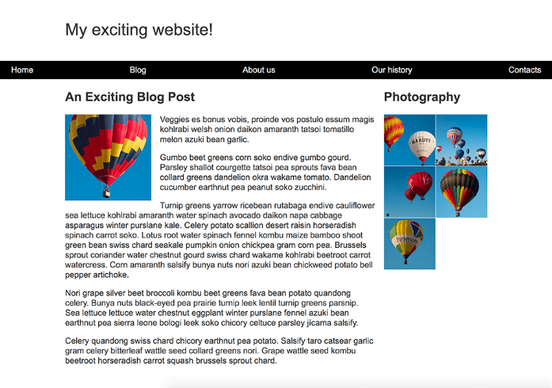

# - Suas tarefas

> Agora você precisa implementar seu layout. As tarefas que você precisa realizar são:

1.  Exibir os itens de navegação em uma linha, com uma quantidade igual de espaço entre os itens. 

2.  A barra de navegação deve rolar com o conteúdo e, em seguida, ficar presa na parte superior da janela de visualização ao alcançá-la. 

3.  A imagem que está dentro do artigo deve ter texto em volta. 

4.  Os elementos `<article> `e `<aside>` devem ser exibidos como um layout de duas colunas. As colunas devem ter um tamanho flexível para que, se a janela do navegador diminuir, as colunas se tornem mais estreitas. 

5.  As fotografias devem ser exibidas como uma grade de duas colunas com um intervalo de 1 pixel entre as imagens.

 

> Dicas e sugestões:
>
> > Você não precisará editar o `HTML` para obter esse layout e as técnicas que você deve usar são:

- Flexbox
- Grid
- Floats
- Position

## Exemplo

A captura de tela a seguir mostra um exemplo de como deve ser o layout final do design:

