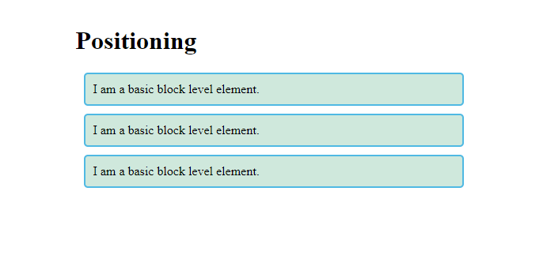
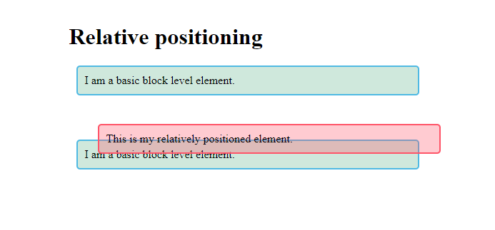
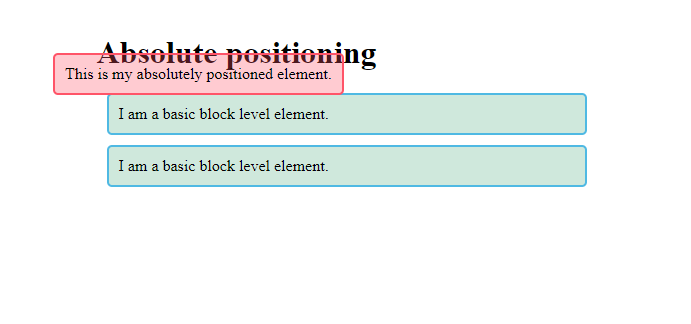
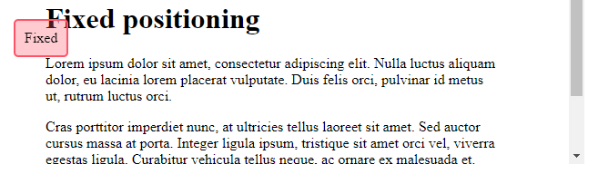
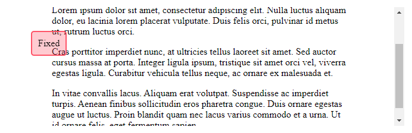
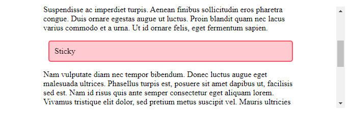
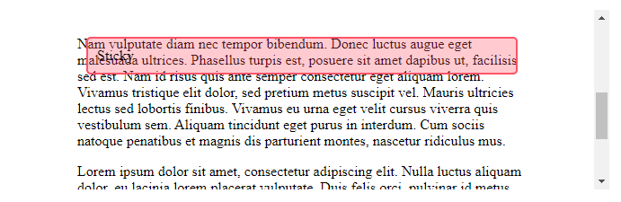

# - Técnicas de posicionamento

> O posicionamento permite que você mova um elemento de onde ele seria colocado em fluxo normal para outro local. O posicionamento não é um método para criar os layouts principais de uma página; trata-se mais de gerenciar e ajustar a posição de itens específicos em uma página.

Existem, no entanto, técnicas úteis para obter padrões de layout específicos que dependem da propriedade `position`. Compreender o posicionamento também ajuda a entender o fluxo normal e o que significa mover um item para fora do fluxo normal.

<b>Existem cinco tipos de posicionamento que você deve conhecer:</b>

- <b>`Static positioning`</b> é o padrão que cada elemento recebe. Significa apenas "colocar o elemento em sua posição normal no fluxo de layout do documento - nada de especial para ver aqui".

- <b>`Relative positioning`</b> permite modificar a posição de um elemento na página, movendo-o em relação à sua posição no fluxo normal, bem como sobrepondo-o a outros elementos da página.

- <b>`Absolute positioning`</b> move um elemento completamente para fora do fluxo de layout normal da página, como se estivesse em sua própria camada separada. A partir daí, você pode fixá-lo em uma posição relativa às bordas de seu ancestral posicionado mais próximo (que se torna `<html>` se nenhum outro ancestral estiver posicionado). Isso é útil para criar efeitos de layout complexos, como caixas com guias onde diferentes painéis de conteúdo ficam um sobre o outro e são exibidos e ocultos conforme desejado, ou painéis de informações que ficam fora da tela por padrão, mas podem ser feitos para deslizar na tela usando um botão de controle.

- <b>`Fixed positioning`</b> é muito semelhante ao posicionamento absoluto, exceto que ele fixa um elemento em relação à janela de visualização do navegador, não a outro elemento. Isso é útil para criar efeitos como um menu de navegação persistente que sempre permanece no mesmo lugar na tela enquanto o restante do conteúdo rola.

- <b>`Sticky positioning`</b> é um método de posicionamento mais recente que faz um elemento agir como `position: relative` até atingir um deslocamento definido da janela de visualização, ponto em que ele age como `position: fixed`.

## Exemplos de posicionamentos

> Para familiarizar-se com essas técnicas de layout de página, mostraremos alguns exemplos rápidos. Todos os nossos exemplos terão a mesma estrutura `HTML` (um título seguido por três parágrafos), que é o seguinte:

```html
<h1>Positioning</h1>

<p>I am a basic block level element.</p>
<p class="positioned">I am a basic block level element.</p>
<p>I am a basic block level element.</p>
```

Este `HTML` será estilizado por padrão usando o seguinte `CSS`:

```css
body {
  width: 500px;
  margin: 0 auto;
}

p {
  background-color: rgb(207, 232, 220);
  border: 2px solid rgb(79, 185, 227);
  padding: 10px;
  margin: 10px;
  border-radius: 5px;
}
```

A saída renderizada é a seguinte:


<br>

## Position Relative:

O posicionamento relativo permite deslocar um item de sua posição padrão no fluxo normal. Isso significa que você pode realizar uma tarefa como mover um ícone um pouco para baixo para que ele se alinhe com um rótulo de texto. Para fazer isso, podemos adicionar a seguinte regra para adicionar posicionamento relativo:

```css
.positioned {
  position: relative;
  top: 30px;
  left: 30px;
}
```

Aqui damos ao nosso parágrafo do meio um `position` valor de `relative`. Isso não faz nada por conta própria, então também adicionamos propriedades `top e left`. Estes servem para mover o elemento afetado para baixo e para a direita. Isso pode parecer o oposto do que você esperava, mas você precisa pensar nisso como o elemento sendo empurrado em seus lados esquerdo e superior, o que resulta em movimento para a direita e para baixo.<br>
A adição deste código dará o seguinte resultado:



<br>

## Posicionamento Absolute:

O posicionamento absoluto é usado para remover completamente um elemento do fluxo normal e, em vez disso, posicioná-lo usando deslocamentos das bordas de um bloco que o contém.

Voltando ao nosso exemplo original não posicionado, poderíamos adicionar a seguinte regra `CSS` para implementar o posicionamento absoluto:

```css
.positioned {
  position: absolute;
  top: 30px;
  left: 30px;
}
```

Aqui damos ao nosso parágrafo do meio um `position` valor de e `absolut` e as mesmas propriedades de antes. <br>Adicionar este código produzirá o seguinte resultado:



Isso é muito diferente! O elemento posicionado agora foi completamente separado do resto do layout da página e fica por cima dele. Os outros dois parágrafos agora ficam juntos como se seu irmão posicionado não existisse. As propriedades `top` e `left` têm um efeito diferente em elementos absolutamente posicionados do que em elementos relativamente posicionados. Neste caso, os deslocamentos foram calculados a partir da parte superior e esquerda da página. É possível alterar o elemento pai que se torna esse contêiner.

<br>

## Posicionamento Fixed:

O posicionamento fixo remove nosso elemento do fluxo de documentos da mesma forma que o posicionamento absoluto. No entanto, em vez de os deslocamentos serem aplicados a partir do contêiner, eles são aplicados a partir da `viewport`. Como o item permanece fixo em relação à janela de visualização, podemos criar efeitos como um menu que permanece fixo à medida que a página rola abaixo dele.

Para este exemplo, nosso `HTML` contém três parágrafos de texto para que possamos rolar pela página, além de uma caixa com a propriedade de `position: fixed`.

```css
.positioned {
  position: fixed;
  top: 30px;
  left: 30px;
}
```

```html
<h1>Fixed positioning</h1>

<div class="positioned">Fixed</div>

<p>
  Lorem ipsum dolor sit amet, consectetur adipiscing elit. Nulla luctus aliquam
  dolor, eu lacinia lorem placerat vulputate. Duis felis orci, pulvinar id metus
  ut, rutrum luctus orci.
</p>

<p>
  Cras porttitor imperdiet nunc, at ultricies tellus laoreet sit amet. Sed
  auctor cursus massa at porta. Integer ligula ipsum, tristique sit amet orci
  vel, viverra egestas ligula. Curabitur vehicula tellus neque, ac ornare ex
  malesuada et.
</p>

<p>
  In vitae convallis lacus. Aliquam erat volutpat. Suspendisse ac imperdiet
  turpis. Aenean finibus sollicitudin eros pharetra congue. Duis ornare egestas
  augue ut luctus. Proin blandit quam nec lacus varius commodo et a urna. Ut id
  ornare felis, eget fermentum sapien.
</p>
```




<br>

## Posicionamento Sticky

O posicionamento adesivo é o método de posicionamento final que temos à nossa disposição. Mistura `posicionamento relativo` com `posicionamento fixo`. Quando um item tiver `position: sticky`, ele rolará no fluxo normal até atingir os deslocamentos da janela de visualização que definimos. Nesse ponto, ele fica `"preso"` como se tivesse `position: fixed` aplicado.

```css
.positioned {
  position: sticky;
  top: 30px;
  left: 30px;
}
```




<br>
