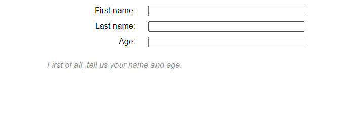

# Layout da Tabela

As tabelas `HTML` são boas para exibir dados tabulares, mas há muitos anos - antes mesmo que o `CSS` básico fosse suportado de forma confiável nos navegadores - os desenvolvedores da Web costumavam também usar tabelas para layouts de páginas da Web inteiros, colocando seus `cabeçalhos, rodapés, colunas` etc. em várias tabelas, linhas e colunas. Isso funcionou na época, mas tem muitos problemas: os layouts de tabela são `inflexíveis`, muito pesados ​​na marcação, difíceis de depurar e semanticamente errados (por exemplo, usuários de leitores de tela têm problemas para navegar nos layouts de tabela).

A aparência de uma tabela em uma página da Web quando você usa a marcação de tabela se deve a um conjunto de propriedades `CSS` que definem o layout da tabela. Essas mesmas propriedades também podem ser usadas para definir elementos que não são tabelas, um uso que às vezes é descrito como "`usando tabelas CSS`".

O exemplo abaixo mostra um desses usos. Deve-se notar que o uso de tabelas `CSS` para layout deve ser considerado um método legado neste momento e deve ser usado apenas para suportar navegadores antigos que não possuem suporte para `Flexbox` ou `Grid`.

Vejamos um exemplo. Primeiro, alguma marcação simples que cria um formulário `HTML`. Cada elemento de entrada tem um rótulo e também incluímos uma legenda dentro de um parágrafo. Cada par de rótulo/entrada é encapsulado em um `<div>`para fins de layout.

```html
<form>
  <p>First of all, tell us your name and age.</p>
  <div>
    <label for="fname">First name:</label>
    <input type="text" id="fname" />
  </div>
  <div>
    <label for="lname">Last name:</label>
    <input type="text" id="lname" />
  </div>
  <div>
    <label for="age">Age:</label>
    <input type="text" id="age" />
  </div>
</form>
```

Quanto ao `CSS`, a maioria é bastante comum, exceto pelos usos da display propriedade. O `<form>`, `<div>s` e `<label>s` e `<input>s` foram instruídos a serem exibidos como uma tabela, linhas de tabela e células de tabela, respectivamente. Basicamente, eles agirão como marcação de tabela `HTML`, fazendo com que os rótulos e as entradas se alinhem bem por padrão. Tudo o que precisamos fazer é adicionar um pouco de tamanho, margem, etc., para tornar tudo um pouco melhor e pronto.

Você notará que o parágrafo da legenda foi fornecido `display: table-caption;`, o que faz com que ele funcione como uma tabela `<caption>`, e `caption-side: bottom;` para dizer à legenda para ficar na parte inferior da tabela para fins de estilo, mesmo que a marcação esteja antes dos `<input>` elementos na fonte. Isso permite um bom pouco de flexibilidade.

```css
html {
  font-family: sans-serif;
}

form {
  display: table;
  margin: 0 auto;
}

form div {
  display: table-row;
}

form label,
form input {
  display: table-cell;
  margin-bottom: 10px;
}

form label {
  width: 200px;
  padding-right: 5%;
  text-align: right;
}

form input {
  width: 300px;
}

form p {
  display: table-caption;
  caption-side: bottom;
  width: 300px;
  color: #999;
  font-style: italic;
}
```

Isso nos dá o seguinte resultado:<br>


> Nota: O layout da tabela, ao contrário dos outros tópicos anteriores, não será abordado neste módulo devido à sua aplicação legada.
